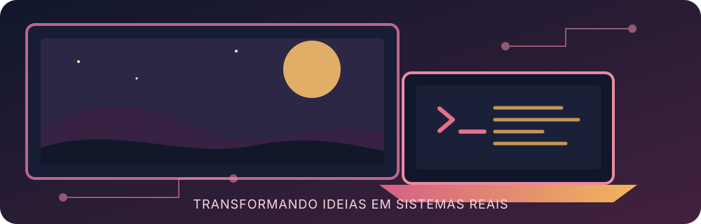

  

---

  
  

---

## 📫 Como entrar em contato comigo

  
  

---

## 💻 Tecnologias

  
  
  
  
  
  

---

## 🎨 Linguagens de Marcação e Estilo

  
  

---

## 🛠 Ferramentas

  
  

---

  

---

## 🐍 Minhas contribuições

